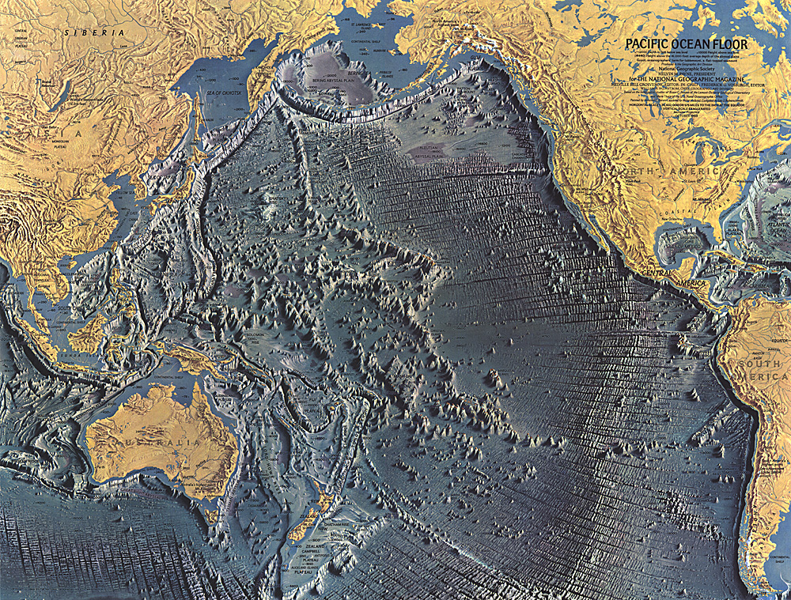

People who know me at all know that I do not believe in god. In fact, I would label myself an antitheist. I haven’t been able to shake my disdain for theism from my sleeve. Some have wondered to me how I went from Book of Mormon totin’ Mormon missionary to positive atheism and antitheism. What tipped me over the edge?

The house of cards that was my strong Christian belief fell near the end of my bachelor of science pursuit. It became impossible to continue to reconcile what I’d learned in geology, physics, statistics, philosophy, logic, psychology, and biology with what I’d known my entire life. And what a rush it’s been! The world is so much clearer now; but people are so stupider.

Things bothered me about the members of the church for a long time. My motivation, however, was always to get them to more closely follow the doctrines. Why do unbaptized children take the sacrament? Why are infants blessed at church? Why do people always pray that things might happen? Like, duh, things are going to happen. Why do people pray for sunny weather for the church picnic when the farmers are desperately praying for rain? The members, and many of the leaders who didn’t put them straight, were the problem, not the church. Kirsten thinks I would have left the church eventually even without my liberal arts training because of my skeptical nature. I’m not so sure. I think the evidence has to be stronger than the belief and that, for me, was a pretty daunting amount.

Physics taught me how stuff works. Then I saw a special on The History Channel critical of the Great Flood and knew they weren’t making it up. My physics training wouldn’t allow me to discount the overwhelming evidence against such a magnificent and catastrophic event. If there was no flood and the modern prophet, Gordon B. Hinckley, was allowing this story to be taught as fact then he must not be talking to god. If Gordon isn’t talking to god then he’s not a prophet. If he’s not a prophet the church isn’t true. It’s as simple as that.

Statistics taught me to throw out the fringe data of a sample. All of a sudden the anecdotal miracle stories I’d been hearing in testimony meetings and Sunday School and reading about in the scriptures were meaningless. Without those stories to prop up faith doubt is inevitable.

Biology, of course, taught me the undeniable fact of evolution and contradicted the creation myth.

The geology course I took had a profound impact and is probably the greatest contributor to my apostasy. The textbook we used has a picture of the floor of the Pacific Ocean. The Hawaiian Island chain extends all the way to Alaska. The process that created those ocean mountains is too complex for this post. Suffice it to say, it didn’t happen in less than six thousand years. The earth, I learned, is a very very old planet.

In philosophy I learned how complex hypothetical ethical questions can be. I realized how inadequate religions and their ancient texts are at offering any guidance but for the most basic moral canundrums. I also realized that there is no right and wrong, but an continuum where morality is relative.

In logic I learned how to spot a fallacy and evaluate truth statements. Religion, it turns out, is chock full of fallacious arguments and erroneous conclusions plucked, apparently, from thin air.

In psychology I learned about group dynamics. I remember studying about the Nazis in Germany and discussing how so many people could be deluded into committing heinous acts of hatred toward their fellow humans. I recall applying those principles directly to my church family. Mormons are VERY xenophobic. There is a clear distinction between members and non-members. The majority of most members’ friends are other members. There is intense pressure on and from the individual members to conform to the group’s expectations. Members who leave the group are usually ostracized as a matter of policy. It’s really quite sad and pathetic. Bigotry, as you’d expect, is rampant!

From the time I questioned the authority of the prophet until the time I denied the teachings of the church was, as I recall, about two weeks. I remember sitting on a bench at Waikiki Beach in Hawaii and “deciding”. During those two weeks my mind was in what I can only describe as a whirlwind of thought. It was constant and unrelenting. I tried very hard to reconcile what I knew and what I believed. In the end I failed to do that. The internal struggle I’d been having was over. Reason triumphed gloriously over superstition and fantasy.

It is the best decision I have ever made!! The world is clear. I am happy. For the first time in my life I didn’t feel like I was in a pressure cooker and constantly feeling guilt. Nobody was watching me, nobody was telling me what to do, and nobody was going to punish me for my mistakes. I am liberated and free! I appreciate people now. I don’t have to convert everyone I come in contact with. I don’t have to pray every time life gets difficult. It is great.

The family and friend bit sucks though. People, it turns out, don’t like being told their most cherished beliefs are stupid and factually unsupported, even indirectly. Dealing with bigots sucks. And people who think atheists have horns and worship the devil.

Even if I wanted to I could not go back now. I don’t think anyone chooses what they believe.

